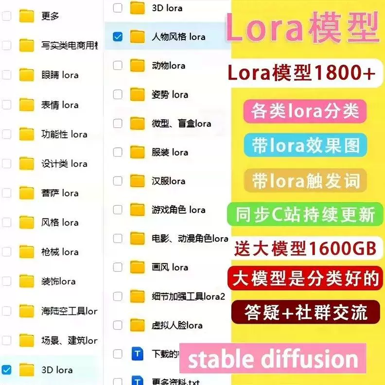
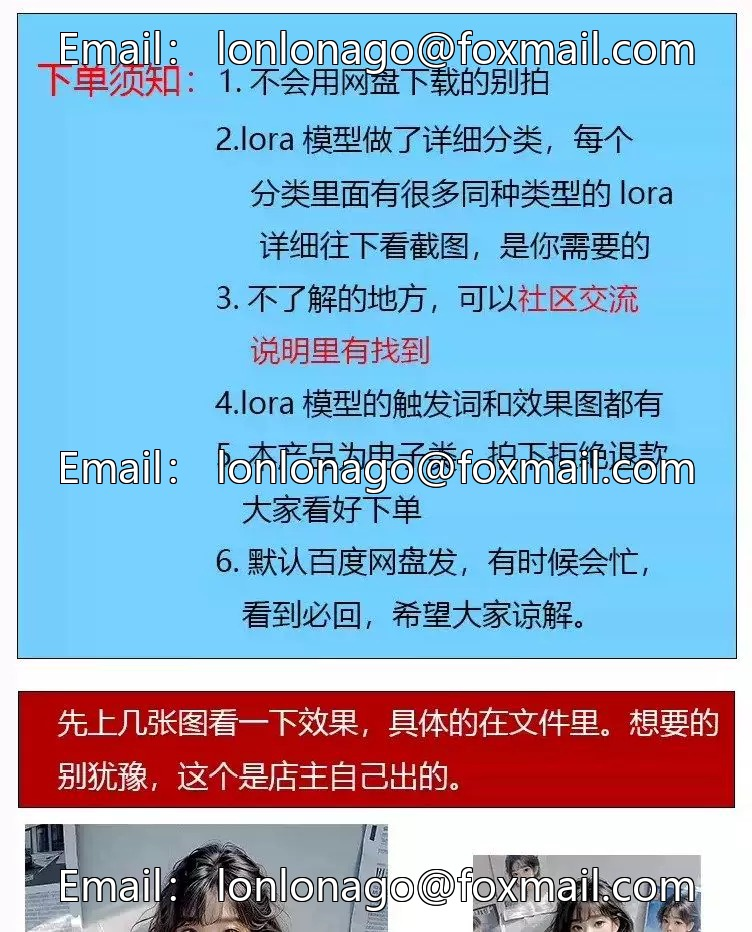
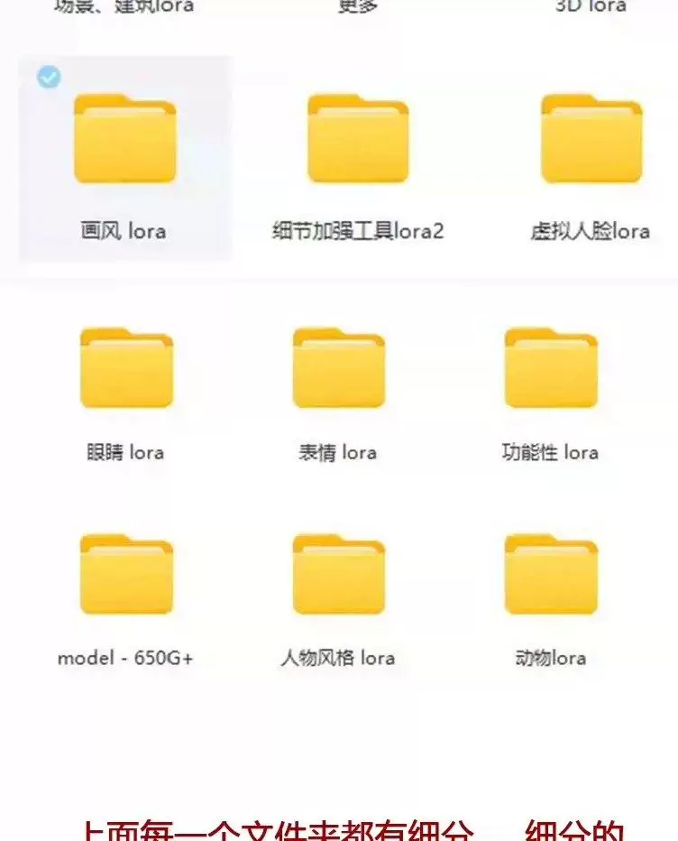
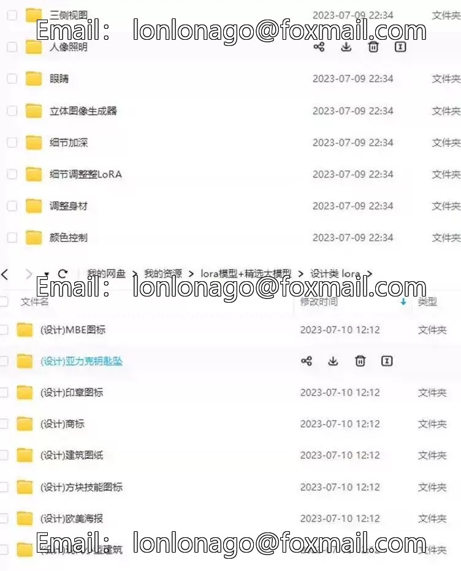

# Second-Generation AI Painting SD Large Model LORA Classification is a deep learning-based image generation technology that can quickly generate corresponding images based on input text descriptions. This model typically uses the Transformer architecture and learns how to convert text descriptions into images through a large amount of training data.

## Body

Instant AI Painting SSD Large Model Lora Classification

(Full product description was not available from the source page.)

## Images

## Payment

Here is a pay link on Stripe ( https://buy.stripe.com/3cs8yP7sY87d0vu9AB ). Please contact me lonlonago@foxmail.com after funding $89, and I will send you a complete data files , thank you!

